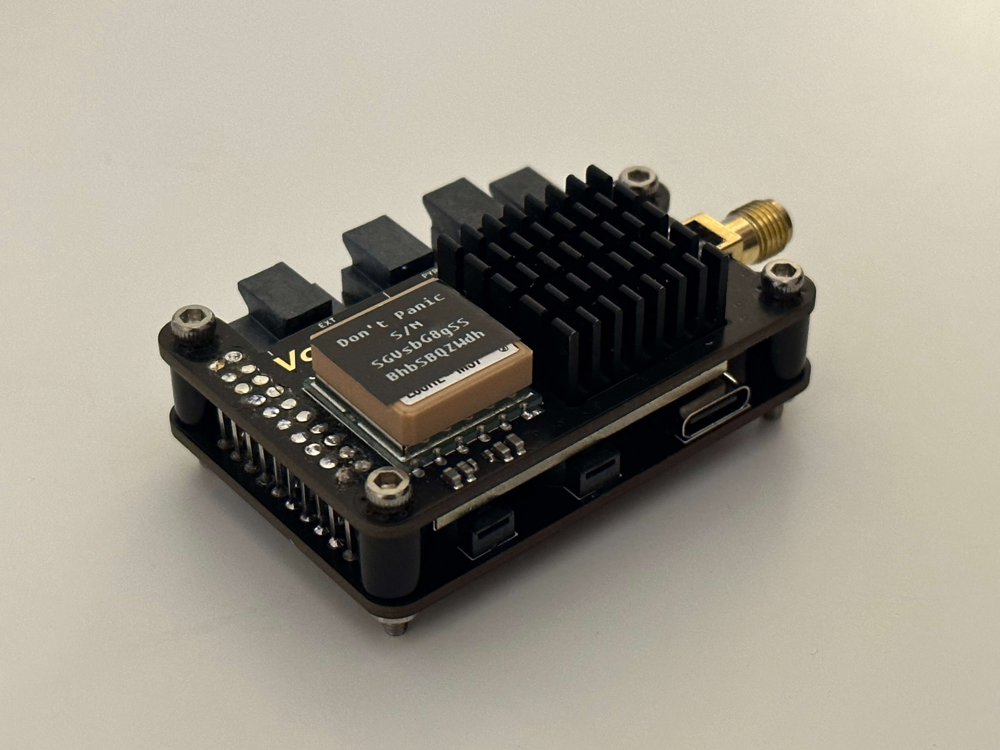
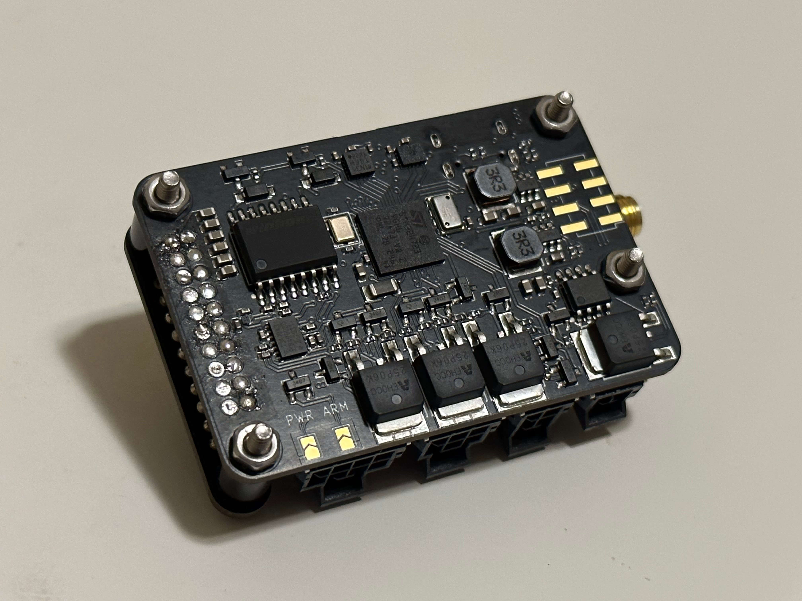

# Void Lake Fusion 4 (VLF4)

SRAD Avionics from the [McMaster Rocketry Team](https://www.macrocketry.ca/)

[Our Avionics Museum](https://mcmasterrocketry.notion.site/Void-Lake-Museum-7bf3bac829b94e0fac715c41c5d70cb9)

## Selling point

- Pyro short circuit protection
- Molex nano-fit connectors
- 1W LoRa, 100km+ LoS range
- GPS + IMU + baro sensor fusion, reducing the chance of ejecting prematurely
- Modern 3D visualizer
- Small
- Open source firmware
- Relatively cheap

## Pyro
- 3 pyro channels, each 8A continuous (current limited by the connector due to size)
- pyro channels not connected to battery+ when not firing (unlike raven)
- continuity detection
- short circuit protection

## Sensors
- MCU: STM32H723
- IMU 1: ±2000deg/s ±16g (LSM6DSMTR)
- IMU 2: ±100g (H3LIS100DLTR)
- Magnetometer: MMC5603NJ
- Barometer: max altitude 30km (MS5607)
- Storage: 64MB NOR Flash (W25Q512JVFIQ)
- GPS: L80RE-M37
- Radio: 1W LoRa (e22-900m30s)

## Connectivity
- 2 buzzers for stereo sound
- usb type-c
- battery: 2 pin molex nano-fit
- power & arming switch: 4 pin molex nano-fit (no large current is carried over switches)
- pyro: 6 pin molex nano-fit
- extension: 8 pin molex nano-fit:
  - ground: 1 pin
  - power out (battery voltage) (only provides power out if the power switch is turned on): 1 pin
  - serial: 2 pins
  - CAN: 2 pins
  - GPIO: 2 pins
- Serial Wire Debug: 5 pin molex pico-clasp
- SMA antenna connector

## Software (WIP, to be open sourced)
- Async embedded rust

## JLCPCB Manufacturing Specifications

Base Material: FR-4
Layers: 6
PCB Thickness: 1.6
**Impedance Control: yes JLC06161H-3313**
PCB Color: Black
Silkscreen: White
Material Type: FR-4 TG155

**Via Covering: Epoxy Filled & Capped**
Surface Finish: ENIG
Gold Thickness: 1 U"
Deburring/Edge rounding: No
Outer Copper Weight: 1 oz
Inner Copper Weight: 0.5 oz
Gold Fingers: No
Flying Probe Test: Fully Test
Castellated Holes: no
Remove Order Number: Specify a location
**Min via hole size/diameter: 0.2mm/(0.3/0.35mm)**
4-Wire Kelvin Test: Yes
Paper between PCBs: No
Appearance Quality: IPC Class 2 Standard
Confirm Production file: Yes
Silkscreen Technology: Ink-jet/Screen Printing Silkscreen
X-out board: Accept
Package Box: With JLCPCB logo
Board Outline Tolerance: ±0.2mm(Regular)
